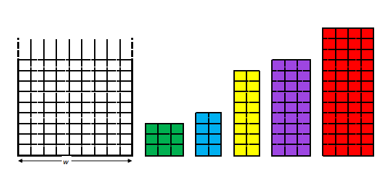

# CP-SAT-SMT 2D Strip Packing problem
2D Strip Packing problem solved with different approaches of combinatorial optimization.
The resolution process was faced with a constraint programming implementation, and with a SAT solver approach both in a constrained SAT formulation and in the more expressive SMT one.

In the first case the Minizinc language (Py3 only for i/o data handling) was used while the other implementation were made in Python3 with the Z3 solver.

[Documentation with approaches explained](Project_report_(full_report).pdf)

Problem example:

